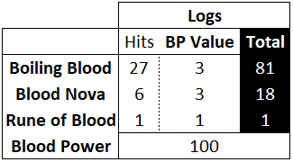
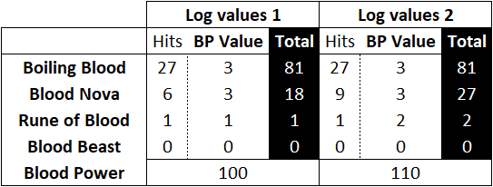
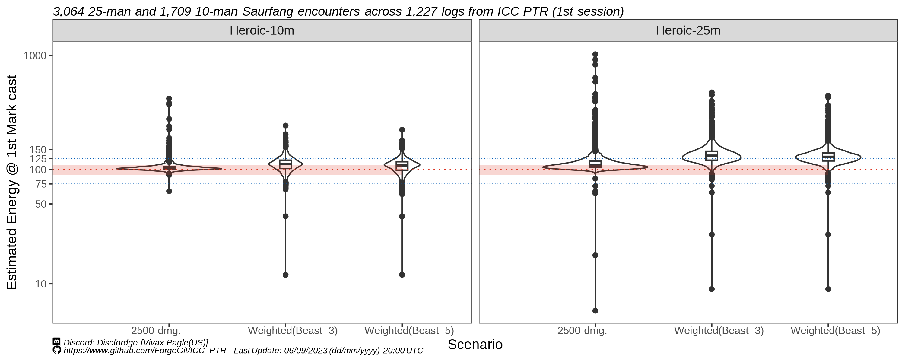

# Deathbringer Saurfang energy generation mechanics - World of Warcraft: Classic WoTLK

## **SUMMARY**
### **Tl;dr**
`2,500 damage taken = ~1 Blood Power` 
BP can be decimal (e.g 7.495 BP), and it accumulates over time. This formula explains very well Saurfang energy generation mechanics.

In this document I explain why this approach works better than other alternatives proposed to measure energy generation on Saurfang, and suggest energy generation is entirely damage based1, rather than "tick" or "cast" based2.

[1] Damage Taken by friendly units, including "pets" such as Army of the Death or Warlock pets.   
Damage taken includes Absorbs and Overkill values.  
[2] Valid sources of damage are Boiling Blood, Rune of Blood, Blood Nova, and Beast melee damage.

## 🌤Preamble

We lack a precise, catch-all method to explain and measure Blood Power (energy) generation on Saurfang, final raid boss of the Lower Spire at Icecrown Citadel.  
We have a general idea of how the mechanic works based on its description, but we cannot precisely explain it or measure it in detail.

Here I describe how using the formula `2,500 damage taken = ~1 Blood Power` we can explain very well the Blood Power generation mechanics of Deathbringer Saurfang.

This approach can be used in logs uploaded to Warcraft Logs Classic to analyze which abilities contributed the most towards BP generation.

Note: From now on, for all intents and purposes, I will refer to Energy on Saurfang as Blood Power or BP.
(A.K.A Runic Power, Blood Energy, Blood Points). 

## 🐗Introduction

### **Introduction Tl,dr:**  
> Four abilities generate BP. Heroic mode Saurfang generates more BP (or faster BP) than normal mode Saurfang. 
> That is all we thought was true until now.

Commonly what we know about WoW game mechanics (in this case, Saurfang BP generation) comes from sites such as [WoWhead Comments](https://www.wowhead.com/wotlk/npc=37813/deathbringer-saurfang#comments), [WowPedia](https://wowpedia.fandom.com/wiki/Deathbringer_Saurfang), and [WoW-Wiki](https://wowwiki-archive.fandom.com/wiki/Deathbringer_Saurfang), with some of this information coming from "OG" [Blizzard Forum posts from 2010](https://web.archive.org/web/20100213045756/http://forums.worldofwarcraft.com/thread.html?topicId=22749002374&sid=1&pageNo=1) or "common knowledge" shared in WoW related communities such as Class Discords. 

More recently, with the first PTR test of ICC, we can now use detailed logs and video recordings to look into the specifics of BP generation.

All of the sources previously mentioned coincide more or less on the following:

  1. Only spell-related damage should contribute towards BP generation
      - These four (4) sources are all "spells casted by" Saurfang that deal physical type damage.
          - Boiling Blood (ID: 72385)
          - Rune of Blood (ID: 72409)
          - Blood Nova (ID: 72380)
          - Blood Beast melee hits (ID: 1)
      - Melee damage from the boss on the tanks should not contribute towards BP generation. 
          - Unless it is a Rune of Blood hit, which is different than the standard melee hit.
          
          *Figure 1: Rune of Blood and a melee hit - they are different*

  2. In Heroic mode BP generation seems much faster compared to normal mode.
  
  3. At 100 BP generated, Saurfang casts "Mark of the Fallen Champion" (ID: 72255), which you want to delay as much as possible by getting hit less by the four (4) abilities previously mention. 

There are, however, conflicting or vague attempts at explaining the underlying mechanics of BP generation. For instance: 

- Does "Absorbed" damage count towards BP generation?
    - An old comment suggests Absorbed damage would not count towards BP generation
    
        - A wowhead comment from the 18th December 2009 by 7103 on 2009/12/19 (Patch 3.3.0) says "he doesn't gain BP unless he actually deals damage, meaning a disc priest perma-bubbling our tank and our add kiters doing a stellar job resulted in him only having one mark up when he died."
        - However, in a later patch, it reads: Patch 3.3.2 (2010-02-01): Mitigation abilities such as Spell holy powerwordshield [Power Word: Shield] will no longer prevent blood power generation.
    
- Does "Mark" damage count towards BP generation?
    - It is suggested mark damage increases BP generation over time.
        - Mark should not generate BP. Or does it? (Spoiler: It should not)
        - Would it add 1 extra BP once or is it 1 extra BP per tick? 
        - Is it because "more marks" are out? or because the longer the fight the more BP is passively generated?
             - (Is there even such a thing as "passive BP" generation?)
    - Old patch notes suggest this should not be the case
        - Patch 3.3.2 (2010-02-01): Deathbringer Saurfang will no longer gain blood power from Mark of the Fallen Champion.
         

- Exactly how much Blood Energy does a Boiling Blood tick contribute? 
    - It is said boiling blood generates somewhere around 2 and 4 BP. 
        - [Old websites](https://typehforheals.com/raid-strategies/wrath-of-the-lich-king/icecrown-citadel/deathbringer-saurfang/#:~:text=Besides%20Blood%20Nova%2C%20Saurfang%20will%20be%20casting%20Boiling,or%20Divine%20Shield%20this%20should%20be%20done%20immediately), [wordpress pages](https://dontstandinthefire.wordpress.com/tactics/icecrown-citadel/deathbringer-saurfang-10-man/) and even WoWHead comments from the past give us some numbers that usually disagree with each other.
    - It is also said it generates more BP based on how much damage each tick hit for. 
        - However, we know from looking at videos + log simultaneously [1] that the same boiling blood ticking for the same amount of damage can give both 2 BP and 3 BP. 
        - i.e. Two consecutive ticks of 6,500 damage each giving 2 and 3 BP respectively.
      
  
*Figure 2: On the following document, this guy argument from 2010 stating BP gains are "consistent" will be utterly destroyed.*

## 📅Current Understanding

### **Current Understanding Tl,dr:**  
> BP generation goes like: Blood Beast melee > Blood Nova >= Blood Boiling tick >= Rune of Blood

It is usually agreed upon that from the four (4) abilities in the encounter that generate BP, Blood Beast melee hits are usually the biggest source of BP.

In order of "most to least BP generation", the list would go like this:

  - Blood Beast melee > Blood Nova >= Blood Boiling tick >= Rune of Blood 

We can sort of confirm this by doing one of the following measurements.

### A. Basic log measurement 

A common and simple method used to quickly give each ability a value or "weighting" is to add up the times each ability dealt damage and assume each of those hits gave a "fixed" amount of BP.

  
*Figure 3: Illustrated example of how many times each ability hit a player over a period of time. From here you would usually assume they all add up to at least 100 BP.*

This method would normally place the value of abilities as:

- Boiling Blood 2-3 BP
- Blood Nova at 2-3 BP
- Rune of Blood at 1-3 BP
- Blood Beast melee at 2-18 BP (the wide range has varying explanations and causes for it, apparently explained by how "big" or "hard" the hit was).

  
*Figure 4: It works! Now try it with other logs, lmao.*

The issue with this approach is that it won't work with all logs, and relies in adjusting (read: optimizing) your values to make them add up as close as possible to 100, with no clear rule or explanation.  
This will usually result in the estimation either falling short of reaching 100 BP, or going well past 100 BP by the time the first mark goes out.

  
*Figure 5: Estimated BP at the moment of first mark cast on all PTR logs using the weights on the table of Figure 4. "Beast" numbers specify which value was used for Blood Beast melee hits weightings. Shaded red area is the range from 90 to 110 BP estimated at first mark cast. Blue dotted lines indicate the  150 BP and 75 BP marks.* 

### B. In-Game Energy Bar Measurement

A more accurate analysis of BP generation relies on visualizing the boss energy bar in-game, which updates roughly every 3s. 
This value directly provided by the game (but not registered in logs) can be used as our real value of reference.

  
*Figure 6: In yellow, the energy bar (BP) of Saurfang seen in-game from different UIs. The image on the right is Fojji's Weakaura displaying the Energy value separately from the Boss Frame.*

Using this method, two Saurfang Heroic logs (25 man and 10 man) were analyzed along with to their recordings by `overrated_` and `oozeness`.

  - **LOG #1** Joardee <Fusion> Saurfang Heroic 25 man:
      - Log #1: https://classic.warcraftlogs.com/reports/4aGYdP3kyBNchRQf#fight=10&type=damage-taken&options=0&by=ability
      - Vod #1: https://youtu.be/eVM0n_3IUAQ?t=894
        
  - **LOG #2** Oozeness Saurfang Heroic 10 man: 
      - Log #2: https://classic.warcraftlogs.com/reports/ZWbAJC2nLcHRkhdG#translate=true
      - Vod #2: https://www.youtube.com/watch?v=BYIly4KoEqY&ab_channel=Oozeness 

  
*Figure 7: Two Fight Club discord members cooking.  On the left, Naz with LOG #1. On the right, Oozeness with LOG #2.*

However, attempts at assigning a BP value to each ability results in inconsistent, non-preproduceable weightings, that rely in several of caveats and conditions that do not always apply to all cases.

For instance, using log #2 Wipe #3 (Oozeness 10 man) the weightings [1] would look like this:

  - Boiling Blood tick: 2-3-4 BP
  - Blood Rune application: 1 BP (inconsistent)
  - Blood Rune damage: 2 BP
  - Blood Nova: 3 BP (possibly misses/immune hits counting)
  - Blood Beast melee: 1-3-4-8-9 (damage dealt + Scent of Blood buff presence seem to play a factor) 

The weightings proposed from using video recordings (which include Blood Nova misses as generating BP) would "overestimate" 100 BP on our previous example.  
In other words, going off the values recorded in-game, Saurfang should have casted Mark some seconds earlier than what he did.

*Figure 8: The estimation that works on one log, no longer works on the previous log. Sadge*

## 🔨The 2,500 damage methodology

### **The 2,500 damage methodology Tl,dr:**   
> 2,500 dmg = 1 BP works better than numbers pulled out of our assess.

After sharing notes and ideas with `oozeness`, we came up with the following more generalized approach at estimating BP generation:

Lets assume that BP is accumulated over time and it is not a rounded number as shown by the energy bar. 
(e.g. 0.53 energy, 3.10 energy, 7.9048 energy)

Using logs and the in-game energy bar from Log #1 and Log #2, we know how much energy was generated every 3s, and we can check how much damage was taken by friendly units during that period of time.

  
*Figure 9: Illustrated example of how damage taken was estimated every time the energy bar updated (3s intervals).*

If we continue to do this for several points using Log #1 (Joardee) and Log #2 (Oozeness) as reference, we get a number that approximates ~2,500 damage per BP.

If we assume every `2,500 damage` equals `1 BP`, we can accurately match the values on both logs, and in every other log almost perfectly. 

  
*Figure 10: Estimated BP at the moment of first mark cast on all PTR logs comparing different approaches at estimating BP. "Beast" numbers specify which value was used for Blood Beast melee hits weightings. Shaded red area is the range from 90 to 110 BP estimated at first mark cast. Blue dotted lines indicate the  150 BP and 75 BP marks.* 

## 🔮Results 

